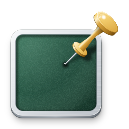
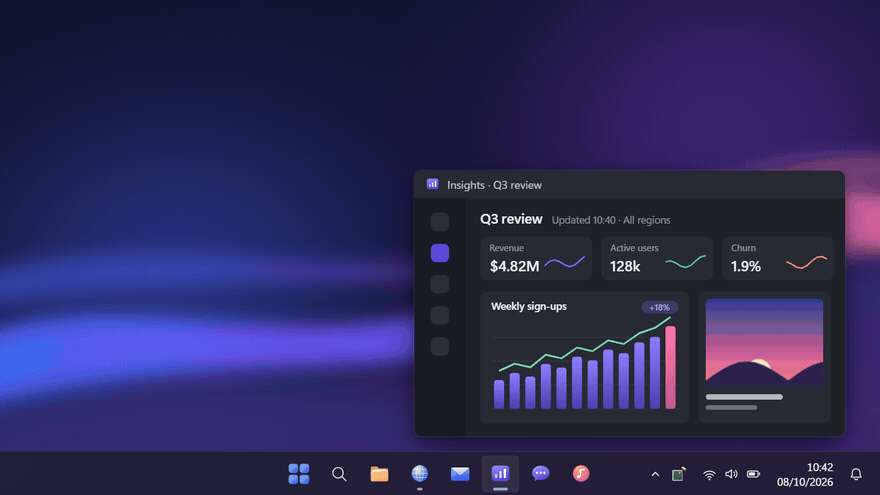
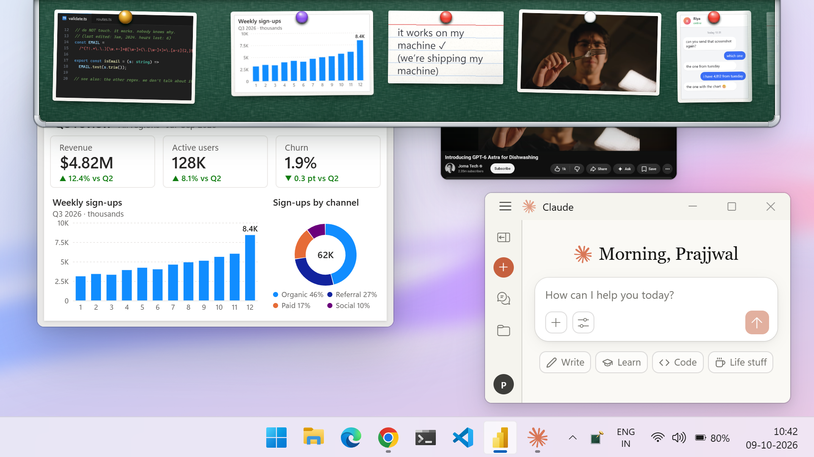
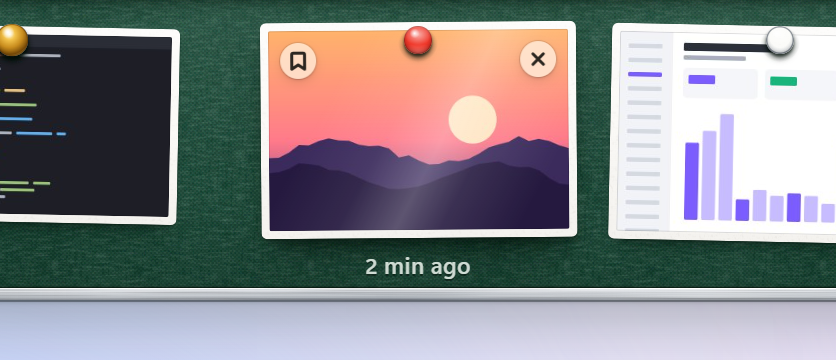
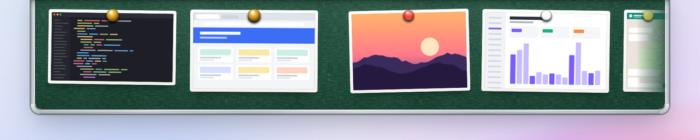
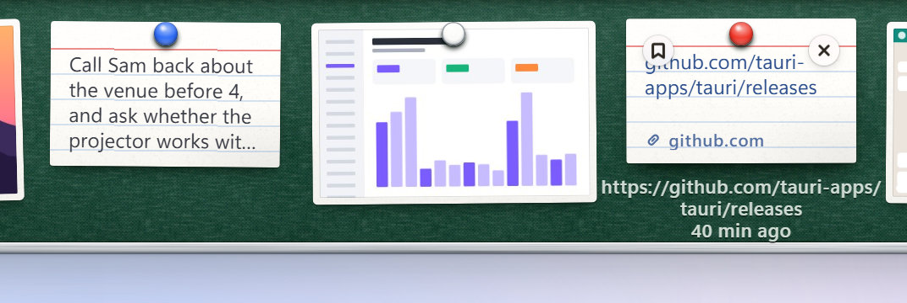

<p align="center">
  
</p>

<h1 align="center">Snip it. It’s tacked.</h1>

<p align="center"><b>The top of your screen, finally useful.</b><br>
Tack is a small pinboard for Windows that hangs just above the top edge of your screen.</p>

<p align="center">
  <picture>
    <source srcset="docs/assets/demo.webp" type="image/webp">
    
  </picture>
</p>

Take a screenshot the way you always do and Tack pins it to a strip of green
felt in a slim aluminium frame, as a photo print. The board swings down for a
moment to show it, then folds away above the screen. Nudge the pointer
against the top edge, or press **Win + Alt + S**, and it comes back, ready to
copy, open, edit or drag a capture straight into another app.

It picks up captures from Snipping Tool (Win + Shift + S), the Print Screen
key, or any tool that saves to your Screenshots folder. Text and links can
go up too, on purpose: select something and press **Win + Alt + C**, or drag
it to the top of the screen and drop it on the board, and it is pinned as a
small paper note. The board is a single row: newest first, with older prints
a scroll away. Keep the ones you still need; the rest quietly age out after
a week.

And it's on your phone too. Snip on your PC and it's in your pocket; snap a
photo on your phone and it flies onto your board, on Wi-Fi or mobile data.
[Two minutes to set up.](#your-board-on-your-phone)

<p align="center">
  <picture>
    <source media="(prefers-color-scheme: dark)" srcset="docs/assets/hero-dark.png">
    
  </picture>
</p>

<table>
  <tr>
    <td width="50%">
      <picture>
        <source media="(prefers-color-scheme: dark)" srcset="docs/assets/hover-dark.png">
        
      </picture>
    </td>
    <td width="50%">
      <picture>
        <source media="(prefers-color-scheme: dark)" srcset="docs/assets/row-dark.png">
        
      </picture>
    </td>
  </tr>
  <tr>
    <td>Hover a print for <b>Keep</b>, <b>×</b> and how old it is.</td>
    <td>Kept prints lead the row with brass pins; scroll for older ones.</td>
  </tr>
  <tr>
    <td colspan="2">
      <picture>
        <source media="(prefers-color-scheme: dark)" srcset="docs/assets/notes-dark.png">
        
      </picture>
    </td>
  </tr>
  <tr>
    <td colspan="2">Text and links go up as paper notes (<b>Win + Alt + C</b>, or drop them on the board).</td>
  </tr>
</table>

## Your board, on your phone

Your board goes everywhere your phone does. Open it on your phone and your
latest snips are right there, ready to save or send. Take a photo, tap
**Pin photo**, and it lands on your PC's board a moment later, the same way a
screenshot does. It works at home, at the office, on mobile data in another
city. No account with Tack and no cloud: your phone talks straight to your PC
through [NetBird](https://netbird.io), a free, open-source private network
built on WireGuard.

Set it up once:

1. Install [NetBird](https://docs.netbird.io/get-started/install) on your PC
   and your phone, and sign in to the same account on both.
2. In Tack's tray menu, choose **Use on your phone…** and switch it on.
3. Scan the QR code with your phone, then click **Allow** on your PC.

Add the page to your home screen and your board is one tap away from then on.

Only devices on your NetBird network can even ask, and only the ones you
allow get in. Everything stays on your PC: your phone reads the board from
it directly, through NetBird's encrypted tunnel, and nothing is uploaded
anywhere.

## Gestures

On a print:

- **Click** to put the full image on the clipboard.
- **Double-click** to open it in your default image viewer.
- **Press and hold** to open it in Paint (or whatever handles "Edit").
- **Drag** it out as a real file. Dropping into an app (chat, email, a
  document) sends a copy and the print stays pinned. Dropping into an
  Explorer folder, the Desktop or the Recycle Bin moves the file, and the
  print is unpinned.
- **Right-click** for Copy, Open, Edit, Show in Explorer, Keep, Unpin and
  Move to Recycle Bin, plus Save to Pictures for a capture that was never saved.
- **Keep** a print (hover, then the pin button) to give it a brass pin: kept
  prints stay at the front of the row and never age out.
- **Hover** and press the small **×** to unpin a print. The file itself is
  left alone.

On a note:

- **Click** to copy its text (a link note copies the link).
- **Double-click** a link to open it in your browser, or a text note to
  unfold it and read all of it; Esc or a click elsewhere folds it again.
- **Press and hold** to edit it in Notepad; the note follows your changes.
- Keep, unpin, drag out and the right-click menu work as on a print.
  Hovering a link shows its full address.

Pinning things on purpose:

- **Win + Alt + C** pins what is selected in the app you are using: text
  becomes a note (a link note if it is one address), a picture a print,
  copied PNG or JPEG files prints of those files. Your clipboard is left as
  it was, and copies a password manager marked private are never pinned. If
  nothing is selected, the board says so.
- **Drag** text, a link, a picture or image files to the top edge of the
  screen: the board comes down, and dropping on it pins.

The board itself:

- Hold the pointer against the very top edge of a monitor for under half a
  second and the board drops down on that monitor. It goes back up once the
  pointer has left it, or when you click elsewhere.
- **Win + Alt + S** shows or hides it from anywhere. Opened this way it
  takes the keyboard: **←** and **→** move between prints (**Home**, **End**),
  **Enter** copies, **Ctrl + Enter** opens, **K** keeps, **Delete** unpins,
  **Shift + F10** or the Menu key opens the menu, and **Esc** puts it away
  and gives the keyboard back to the app you were in. It works with screen
  readers and High Contrast.
- Both shortcuts can be changed (or turned off) from the tray's
  **Shortcuts…**; if another app already has one, the tray menu says so.
- The tray icon toggles it on a left click; its menu can clear the board,
  open the Screenshots folder, switch edge reveal, sounds and starting with
  Windows on or off, and change the shortcuts.

If Snipping Tool is set not to save screenshots automatically, Tack keeps its
own copy of each capture in `%LOCALAPPDATA%\Tack\Captures` while the print is
pinned. When the print is unpinned, cleared or ages out, that copy goes to the
Recycle Bin, never deleted outright, so you can still restore it.
**Save to Pictures** moves it into your Screenshots folder for good.

## Private by design

Tack never sends your screenshots or anything else anywhere, and never talks
to the internet. Out of the box its own code has no network access, and the
web view's content security policy only permits the app's own files and its
local IPC channel. The one exception is yours to switch on: with **Use on
your phone**, Tack answers your own devices, and only on your PC's NetBird
address, never on your Wi-Fi or office network. A device gets in only after
you click Allow on the PC, and you can remove it at any time. Tack also switches off the network
services of Microsoft's WebView2 runtime, which draws the board (account
sign-in, secure DNS probes, proxy auto-detection, SmartScreen): in our
measurements it opens no connections at all. See [docs/privacy.md](docs/privacy.md)
for what was measured and the little that sits outside an app's control. What it
stores is small and local: the paths of pinned files plus your settings in
`%APPDATA%\Tack\board.json`, unsaved Snipping Tool captures in
`%LOCALAPPDATA%\Tack\Captures`, and notes as text files in
`%LOCALAPPDATA%\Tack\Notes`.

Tack watches the clipboard only to notice images placed there by Snipping
Tool. Anything copied by other programs is ignored, as is content an app has
flagged as excluded from clipboard monitoring. Text is never picked up on
its own: only Win + Alt + C reads a copy, the one it asked for, and then
puts your clipboard back as it was. Links on notes are never fetched.

## Install

Tack runs on Windows 10 and 11 with the WebView2 runtime (built into Windows
11). There is no published installer yet, so build it as described below;
`npm run build` produces an NSIS installer under
`target/release/bundle/nsis/`.

## Build it yourself

You need [Rust](https://rustup.rs) (stable, MSVC toolchain), the Visual
Studio C++ Build Tools and Node.js 20 or newer.

```sh
npm install          # installs the Tauri CLI
npm run dev          # debug build, then runs it
npm run build        # optimised build plus installer
cargo test --workspace
```

You can also work on the board's look and animations in an ordinary browser,
without Rust: run `npm run preview` and open
<http://localhost:5178/dev/preview.html>. [docs/development.md](docs/development.md)
has the details.

## Repository map

```
crates/
  tack-core/      board model, notes, history and Keep, duplicate detection, board.json, shortcuts, thumbnails (no Tauri, no Win32)
  tack-windows/   Win32 pieces: Screenshots folder, Snipping Tool clipboard, selection and clipboard restore, file drag, overlay window, focus, hotkeys, shell
  tack-app/       the Tauri app: wiring, IPC commands and events, tray, Shortcuts dialog, context menu, the phone board (phone/)
ui/
  index.html      the board page
  shortcuts.html  the Shortcuts dialog (a small window of its own)
  phone-link.html the "Tack on your phone" window: the switch, the QR code, Allow, your devices
  phone/          the page your phone opens, served by Tack itself over NetBird
  styles/         tokens, board, print, pin, note, hint, cues, motion, flight, a11y; notes/ holds the note-paper sets (index card, classic, sticky)
  scripts/        ES modules: main, ipc, layout, print, note, gestures, keyboard, announce, notice, drop, motion/, sound, state
  dev/            browser preview harness with a fake backend; the pages the README images and demo loop are rendered from
docs/
  architecture.md how the parts connect, with the path of a screenshot and of a click
  ipc.md          every command and event between the UI and the backend
```

## Acknowledgements

Inspired by [Tendedero](https://github.com/alejandrobujan/tendedero) by Alejandro Buján.

Built on [Tauri](https://tauri.app), [windows-rs](https://github.com/microsoft/windows-rs),
[image](https://github.com/image-rs/image), [notify](https://github.com/notify-rs/notify),
[arboard](https://github.com/1Password/arboard),
[trash](https://github.com/Byron/trash-rs),
[tiny_http](https://github.com/tiny-http/tiny-http) and
[qrcode](https://github.com/kennytm/qrcode-rust). The phone board runs over
[NetBird](https://netbird.io).

## License

MIT. See [LICENSE](LICENSE).
